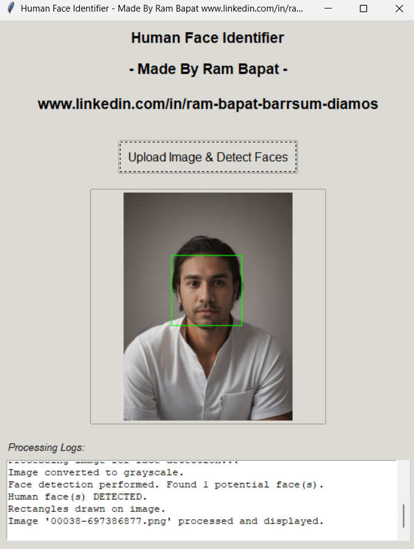

# Python Human Face Identifier 🐍👤

## Made by [Ram Bapat](www.linkedin.com/in/ram-bapat-barrsum-diamos)

A simple yet effective Python desktop application that identifies human faces in uploaded images. Built with Tkinter for the GUI and OpenCV for powerful face detection.


*Caption: Initial view of the application.*


*Caption: Application after a face has been detected in an uploaded image.*


*Caption: Application response when no face is detected.*

<!-- ================================================== -->

## Overview

This project is a desktop GUI application built using Python. It allows users to:

*   Upload an image file (e.g., JPG, PNG) from their local system.
*   View the uploaded image within the application window.
*   See processing logs that detail the steps taken by the application.
*   Receive a clear textual result: "Yes, human face(s) detected!" or "No human face detected."
*   If a face is detected, a green rectangle is drawn around it in the displayed image.

The core face detection is powered by OpenCV, utilizing a pre-trained Haar Cascade classifier. The graphical user interface is built with Python's standard Tkinter library, making it accessible and relatively lightweight. This project serves as a great learning tool for beginners interested in basic computer vision and GUI development with Python.

## Features

*   **User-Friendly GUI:** Simple and intuitive interface built with Tkinter.
*   **Image Upload:** Supports common image formats (JPG, JPEG, PNG, BMP, GIF).
*   **Face Detection:** Utilizes OpenCV's Haar Cascade classifiers for identifying frontal human faces.
*   **Visual Feedback:**
    *   Displays the uploaded image.
    *   Draws rectangles around detected faces on the displayed image.
    *   Clear textual result for detection status (with color coding).
*   **Processing Logs:** A scrolled text area shows real-time logs of the application's actions (e.g., image loading, grayscale conversion, detection results).
*   **Cross-Platform:** Being a Python script, it can run on Windows, macOS, and Linux with Python installed.
*   **Self-Contained:** Relies on standard Python libraries and well-known computer vision packages.

## Tech Stack

*   **Language:** Python 3
*   **GUI Framework:** Tkinter (Python's standard GUI package), `tkinter.ttk` for themed widgets.
*   **Computer Vision:** OpenCV-Python (`cv2`)
*   **Image Handling (for GUI):** Pillow (`PIL` Fork)
*   **Classifier:** Haar Cascade (`haarcascade_frontalface_default.xml` provided by OpenCV)
*   **Development Environment:** Virtual Environment (`venv`)

## Getting Started

To get a local copy up and running, follow these simple steps.

### Prerequisites

*   **Python 3:** Ensure Python 3.x is installed on your system. You can download it from [python.org](https://www.python.org/).
*   **pip:** Python's package installer (usually comes with Python).

### Installation & Setup

1.  **Clone the repository (or download the files):**
    ```bash
    git clone https://github.com/Barrsum/Python-Human-Face-Identifier.git
    cd Python-Human-Face-Identifier

    ```
    *If you downloaded the files as a ZIP, extract them and navigate into the project folder.*

2.  **Create and Activate a Virtual Environment:**
    (Recommended to keep dependencies isolated)
    ```bash
    # For Windows
    python -m venv .venv
    .\.venv\Scripts\activate

    # For macOS/Linux
    python3 -m venv .venv
    source .venv/bin/activate
    ```

3.  **Download the Haar Cascade XML file:**
    *   Ensure `haarcascade_frontalface_default.xml` is present in the root project directory. You can download it from [OpenCV's GitHub repository](https://raw.githubusercontent.com/opencv/opencv/master/data/haarcascades/haarcascade_frontalface_default.xml).

4.  **Install Dependencies:**
    *   First, create a `requirements.txt` file if you haven't already. While the virtual environment is active, run:
        ```bash
        pip freeze > requirements.txt
        ```
    *   Then, install the packages:
        ```bash
        pip install -r requirements.txt
        ```
        *(This should install `opencv-python` and `Pillow`.)*

### Running the Project

1.  **Ensure your virtual environment is active.**
2.  **Run the application script:**
    ```bash
    python face_detector_app.py
    ```
    The application window should open.

## How It Works (Briefly)

The application uses a pre-trained **Haar Cascade classifier** from OpenCV. These classifiers are trained on many positive (images with faces) and negative (images without faces) samples.

1.  When an image is uploaded, it's first converted to grayscale, as Haar cascades typically work better on single-channel images.
2.  The `detectMultiScale` function from OpenCV is then used. This function scans the image at multiple scales (sizes) with a sliding window.
3.  At each window position and scale, features (Haar-like features) are extracted and compared against the trained model.
4.  If the features sufficiently match those of a face, the region is marked as a potential face. Parameters like `scaleFactor` and `minNeighbors` help fine-tune the detection process to reduce false positives.

## Contributing

Contributions, issues, and feature requests are welcome!
Feel free to fork this repository and submit pull requests.

1.  Fork the Project
2.  Create your Feature Branch (`git checkout -b feature/AmazingFeature`)
3.  Commit your Changes (`git commit -m 'Add some AmazingFeature'`)
4.  Push to the Branch (`git push origin feature/AmazingFeature`)
5.  Open a Pull Request

## License

Distributed under the **MIT License**. See `LICENSE.md` for more information.


## Acknowledgements

*   **OpenCV Team:** For providing the powerful computer vision library and pre-trained classifiers.
*   **Tkinter & Pillow Developers:** For the GUI and image manipulation capabilities in Python.
*   **Python Software Foundation:** For the Python language.

---

**Made with ❤️ by Ram Bapat**

*   Connect with me on LinkedIn: [www.linkedin.com/in/ram-bapat-barrsum-diamos](www.linkedin.com/in/ram-bapat-barrsum-diamos)
